Lab: Document Object Model
==========================

Problems for in-class lab for the [“JavaScript Advanced” course @
SoftUni](https://softuni.bg/courses/javascript-advanced). Submit your
solutions in the SoftUni judge system at
<https://judge.softuni.bg/Contests/328/>.

Sum Numbers
-----------

Write a JS function that **reads** two numbers from input fields in a
**web page** and puts their **sum in another field** when the user
**clicks** on a button.

### Input/Output

There will be no input/output, your program should instead **modify**
the DOM of the given HTML document.

| **Sample HTML**                                             |
|-------------------------------------------------------------|
| &lt;input type="text" id="num1" /&gt; +                     
                                                              
 &lt;input type="text" id="num2" /&gt; =                      
                                                              
 &lt;input type="text" id="sum" readonly="readonly" /&gt;     
                                                              
 &lt;input type="button" value="Calc" onclick="calc()" /&gt;  
                                                              
 &lt;script&gt;                                               
                                                              
 function calc() {                                            
                                                              
 // TODO: sum = num1 + num2                                   
                                                              
 }                                                            
                                                              
 &lt;/script&gt;                                              |

### Examples

### 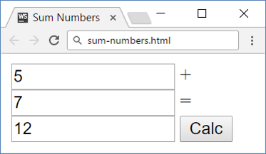 

Show More
---------

Write a JS function that **expands** a hidden section of text when a
link is **clicked**. The link should **disappear** as the rest of the
text shows up.

### Input/Output

There will be no input/output, your program should instead **modify**
the DOM of the given HTML document.

| **Sample HTML**                                                                         |
|-----------------------------------------------------------------------------------------|
| Welcome to the "Show More Text Example".                                                
                                                                                          
 &lt;a href="\#" id="more" onclick= "showText()"&gt;Read more …&lt;/a&gt;                 
                                                                                          
 &lt;span id="text" style= "display:none"&gt;Welcome to JavaScript and DOM.&lt;/span&gt;  
                                                                                          
 &lt;script&gt;                                                                           
                                                                                          
 function showText() {                                                                    
                                                                                          
 // TODO                                                                                  
                                                                                          
 }                                                                                        
                                                                                          
 &lt;/script&gt;                                                                          |

### Examples

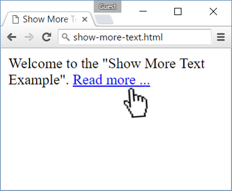
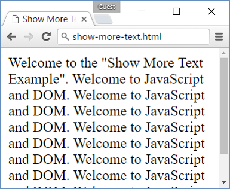

Collect List Items
------------------

Write a JS function that scans a given **HTML list** and **appends** all
collected list items’ text to a **text area** on the same page when the
user **clicks** on a button.

### Input/Output

There will be no input/output, your program should instead **modify**
the DOM of the given HTML document.

| **Sample HTML**                                                   |
|-------------------------------------------------------------------|
| &lt;ul id="items"&gt;                                             
                                                                    
 &lt;li&gt;first item&lt;/li&gt;                                    
                                                                    
 &lt;li&gt;second item&lt;/li&gt;                                   
                                                                    
 &lt;li&gt;third item&lt;/li&gt;                                    
                                                                    
 &lt;/ul&gt;                                                        
                                                                    
 &lt;textarea id="result"&gt;&lt;/textarea&gt;                      
                                                                    
 &lt;br&gt;                                                         
                                                                    
 &lt;button onclick="extractText()"&gt;Extract Text&lt;/button&gt;  
                                                                    
 &lt;script&gt;                                                     
                                                                    
 function extractText() {                                           
                                                                    
 // TODO                                                            
                                                                    
 }                                                                  
                                                                    
 &lt;/script&gt;                                                    |

### Examples

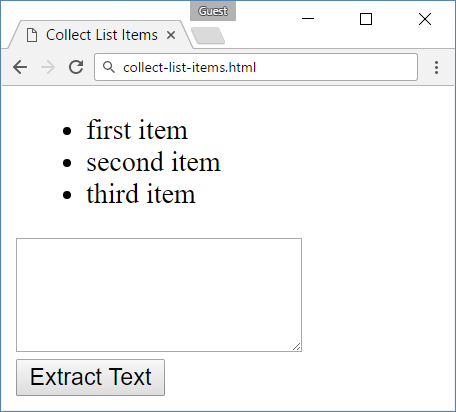
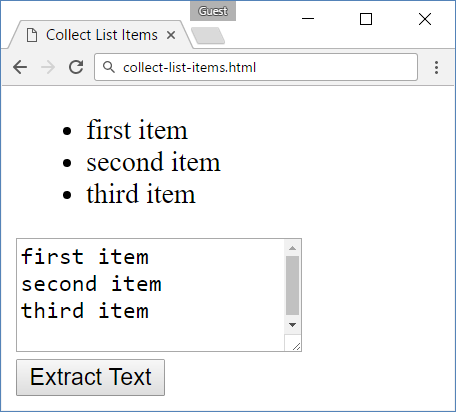

Colorize Table
--------------

Write a JS function that **changes the color** of all **even** rows when
the user **clicks** a button. Apply the color "**Teal**" to the target
rows.

### Input/Output

There will be no input/output, your program should instead **modify**
the DOM of the given HTML document.

| **Sample HTML**                                                          |
|--------------------------------------------------------------------------|
| &lt;table&gt;                                                            
                                                                           
 &lt;tr&gt;&lt;th&gt;Name&lt;/th&gt;&lt;th&gt;Town&lt;/th&gt;&lt;/tr&gt;   
                                                                           
 &lt;tr&gt;&lt;td&gt;Eve&lt;/td&gt;&lt;td&gt;Sofia&lt;/td&gt;&lt;/tr&gt;   
                                                                           
 &lt;tr&gt;&lt;td&gt;Nick&lt;/td&gt;&lt;td&gt;Varna&lt;/td&gt;&lt;/tr&gt;  
                                                                           
 &lt;tr&gt;&lt;td&gt;Didi&lt;/td&gt;&lt;td&gt;Ruse&lt;/td&gt;&lt;/tr&gt;   
                                                                           
 &lt;tr&gt;&lt;td&gt;Tedy&lt;/td&gt;&lt;td&gt;Varna&lt;/td&gt;&lt;/tr&gt;  
                                                                           
 &lt;/table&gt;                                                            
                                                                           
 &lt;button onclick="colorize()"&gt;Colorize&lt;/button&gt;                
                                                                           
 &lt;script&gt;                                                            
                                                                           
 function colorize() {                                                     
                                                                           
 // TODO                                                                   
                                                                           
 }                                                                         
                                                                           
 &lt;/script&gt;                                                           |

### Examples

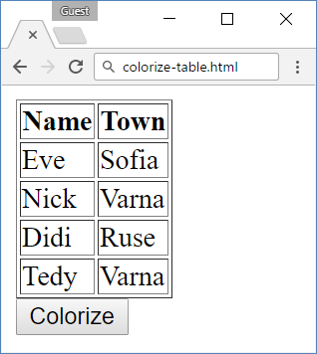
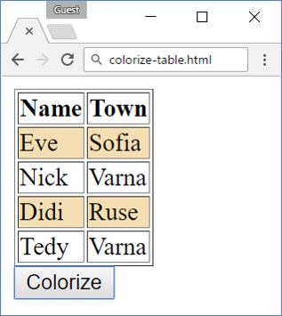

Countdown
---------

Write a JS program that **implements** a web countdown timer that
supports **minutes** and **seconds**. The user should be able to set the
time by calling you function with the number of seconds required. The
time begins to count down as soon as the function is called. Using the
sample code, your function will be called as soon as the page finishes
loading and will begin to count down from 10 minutes.

### Input

Your function will receive a **number parameter**, representing the
starting number of **seconds**.

### Output

There will be no output, your program should instead **modify** the DOM
of the given HTML document.

| **Sample HTML**                                                                                                       |
|-----------------------------------------------------------------------------------------------------------------------|
| &lt;input type="text" id="time" style="border:3px solid blue; text-align:center; font-size:2em;" disabled="true"/&gt; 
                                                                                                                        
 &lt;script&gt;window.onload = function() { countdown(600); }&lt;/script&gt;                                            |

### Examples

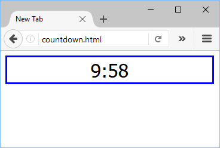

Extract Parenthesis
-------------------

Write a JS function that when **executed**, extracts all parenthesized
text from a target paragraph by given element ID. The result is a
string, joined by "; " (semicolon, space).

### Input

Your function will receive a **string parameter**, representing the
target element ID, from which text must be extracted. The text should be
extracted from the DOM.

### Output

**Return a string** with all matched text, separated by "; " (semicolon,
space).

### Examples

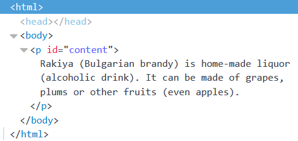

| **Sample call**                                |
|------------------------------------------------|
| let text = extract("content");                 |
| **Result (stored in variable text)**           |
| Bulgarian brandy; alcoholic drink; even apples |

\* Sum Table
------------

Write a JS function that finds the first table in a document and sums
the values in the last column. The result is then displayed in an
element with ID "sum".

### Input/Output

There will be no input/output, your program should instead **modify**
the DOM of the given HTML document.

| **Sample HTML**                                                                 |
|---------------------------------------------------------------------------------|
| &lt;table&gt;                                                                   
                                                                                  
 &lt;tbody&gt;                                                                    
                                                                                  
 &lt;tr&gt;&lt;th&gt;Product&lt;/th&gt;&lt;th&gt;Cost&lt;/th&gt;&lt;/tr&gt;       
                                                                                  
 &lt;tr&gt;&lt;td&gt;Beer&lt;/td&gt; &lt;td&gt;2.88&lt;/td&gt;&lt;/tr&gt;         
                                                                                  
 &lt;tr&gt;&lt;td&gt;Fries&lt;/td&gt; &lt;td&gt;2.15&lt;/td&gt;&lt;/tr&gt;        
                                                                                  
 &lt;tr&gt;&lt;td&gt;Burger&lt;/td&gt; &lt;td&gt;4.59&lt;/td&gt;&lt;/tr&gt;       
                                                                                  
 &lt;tr&gt;&lt;td&gt;Total:&lt;/td&gt; &lt;td id="sum"&gt;&lt;/td&gt;&lt;/tr&gt;  
                                                                                  
 &lt;/tbody&gt;                                                                   
                                                                                  
 &lt;/table&gt;                                                                   
                                                                                  
 &lt;button onclick="sum()"&gt;Sum&lt;/button&gt;                                 |

### Example

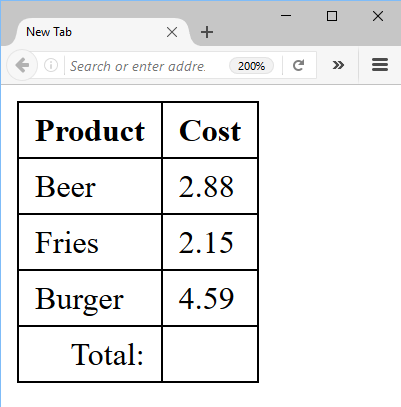
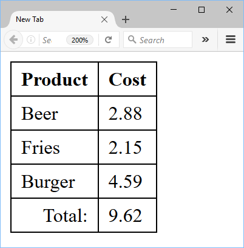
