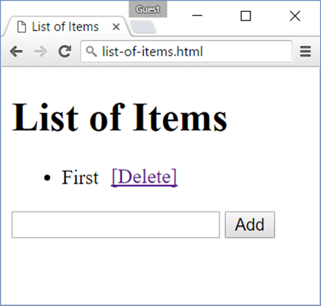

Lab: DOM Manipulation
=====================

Problems for in-class lab for the [“JavaScript Advanced” course @
SoftUni](https://softuni.bg/courses/javascript-advanced). Submit your
solutions in the SoftUni judge system at
<https://judge.softuni.bg/Contests/640/>.

List of Items
-------------

Write a JS function that **read** the text inside an input field and
**appends** the specified text to a list inside an HTML page.

### Input/Output

There will be no input/output, your program should instead **modify**
the DOM of the given HTML document.

| **Sample HTML**                                                                       |
|---------------------------------------------------------------------------------------|
| &lt;h1&gt;List of Items&lt;/h1&gt;                                                    
                                                                                        
 &lt;ul id="items"&gt;&lt;li&gt;First&lt;/li&gt;&lt;li&gt;Second&lt;/li&gt;&lt;/ul&gt;  
                                                                                        
 &lt;input type="text" id="newItemText" /&gt;                                           
                                                                                        
 &lt;input type="button" value="Add" onclick="addItem()"&gt;                            
                                                                                        
 &lt;script&gt;                                                                         
                                                                                        
 function addItem() {                                                                   
                                                                                        
 // TODO: add new item to the list                                                      
                                                                                        
 }                                                                                      
                                                                                        
 &lt;/script&gt;                                                                        |

### Examples

Add and Delete
--------------

Extend the previous problem to display a **\[Delete\] link** after each
list item. **Clicking** it, should **delete** the item with no
confirmation.

### Input/Output

There will be no input/output, your program should instead **modify**
the DOM of the given HTML document.

| **Sample HTML**                          |
|------------------------------------------|
| &lt;h1&gt;List of Items&lt;/h1&gt;       
                                           
 &lt;ul id="items"&gt;&lt;/ul&gt;          
                                           
 &lt;input type="text" id="newText" /&gt;  
                                           
 &lt;input type="button" value="Add"       
 onclick="addItem()"&gt;                   
                                           
 &lt;script&gt;                            
                                           
 function addItem() { ...                  
                                           
 function deleteItem() { ... }             
                                           
 }                                         
                                           
 &lt;/script&gt;                           |

### Examples

Delete from Table
-----------------

Write a JS program that **takes** an e-mail from an **input field** and
**deletes** matching rows from a table. If no entry is found, an
**error** should be displayed in a &lt;div&gt; with ID "**results**".
The error should read "**Not found**."

### Input/Output

There will be no input/output, your program should instead **modify**
the DOM of the given HTML document.

| **Sample HTML**                                                                    |
|------------------------------------------------------------------------------------|
| &lt;table border="1" id="customers"&gt;                                            
                                                                                     
 &lt;tr&gt;&lt;th&gt;Name&lt;/th&gt;&lt;th&gt;Email&lt;/th&gt;&lt;/tr&gt;            
                                                                                     
 &lt;tr&gt;&lt;td&gt;Eve&lt;/td&gt;&lt;td&gt;eve@gmail.com&lt;/td&gt;&lt;/tr&gt;     
                                                                                     
 &lt;tr&gt;&lt;td&gt;Nick&lt;/td&gt;&lt;td&gt;nick@yahooo.com&lt;/td&gt;&lt;/tr&gt;  
                                                                                     
 &lt;tr&gt;&lt;td&gt;Didi&lt;/td&gt;&lt;td&gt;didi@didi.net&lt;/td&gt;&lt;/tr&gt;    
                                                                                     
 &lt;tr&gt;&lt;td&gt;Tedy&lt;/td&gt;&lt;td&gt;tedy@tedy.com&lt;/td&gt;&lt;/tr&gt;    
                                                                                     
 &lt;/table&gt;                                                                      
                                                                                     
 Email: &lt;input type="text" name="email" /&gt;                                     
                                                                                     
 &lt;button onclick="deleteByEmail()"&gt;Delete&lt;/button&gt;                       
                                                                                     
 &lt;div id="result" /&gt;                                                           |

### Examples

Stopwatch
---------

Write a JS program that **implements** a web timer that supports
**minutes** and **seconds**. The user should be able to control it with
**buttons**. Clicking **\[Start\]** **resets** the timer back to zero.
Only one of the buttons should be enabled at a time (you cannot stop the
timer if it’s not running).

### Input/Output

There will be no input/output, your program should instead **modify**
the DOM of the given HTML document.

| **Sample HTML**                                                                                                            |
|----------------------------------------------------------------------------------------------------------------------------|
| &lt;div id="time" style="border:3px solid blue; text-align:center; font-size:2em; margin-bottom:10px"&gt;00:00&lt;/div&gt; 
                                                                                                                             
 &lt;button id="startBtn"&gt;Start&lt;/button&gt;                                                                            
                                                                                                                             
 &lt;button id="stopBtn" disabled="true"&gt;Stop&lt;/button&gt;                                                              
                                                                                                                             
 &lt;script&gt;window.onload = function() { stopwatch(); }&lt;/script&gt;                                                    |

### Examples

Mouse Gradient
--------------

Write a JS program that **detects** and displays how far along a
gradient the user has **moved** their **mouse** on a webpage. Use the
provided HTML and stylesheet (CSS) to test locally. The resulting value
should be **rounded down** and displayed as a **percentage** inside the
**&lt;div&gt;** with ID "**result**".

### Input/Output

There will be no input/output, your program should instead **modify**
the DOM of the given HTML document.

| **Sample HTML**                                     |
|-----------------------------------------------------|
| &lt;html&gt;                                        
                                                      
 &lt;head&gt;                                         
                                                      
 &lt;title&gt;Mouse in Gradient&lt;/title&gt;         
                                                      
 &lt;link rel="stylesheet" href="gradient.css" /&gt;  
                                                      
 &lt;script src="gradient.js"&gt;&lt;/script&gt;      
                                                      
 &lt;/head&gt;                                        
                                                      
 &lt;body onload="attachGradientEvents()"&gt;         
                                                      
 &lt;div id="gradient-box"&gt;                        
                                                      
 &lt;div id="gradient"&gt;Click me!&lt;/div&gt;       
                                                      
 &lt;/div&gt;                                         
                                                      
 &lt;div id="result"&gt;&lt;/div&gt;                  
                                                      
 &lt;/body&gt;                                        
                                                      
 &lt;/html&gt;                                        |

| **gradient.css**                                     |
|------------------------------------------------------|
| \#gradient-box {                                     
                                                       
 width: 300px;                                         
                                                       
 border: 2px solid lightgrey;                          
                                                       
 }                                                     
                                                       
 \#gradient-box:hover {                                
                                                       
 border: 2px solid black;                              
                                                       
 }                                                     
                                                       
 \#gradient {                                          
                                                       
 height: 30px;                                         
                                                       
 color: white;                                         
                                                       
 text-shadow: 1px 1px 10px black;                      
                                                       
 text-align: center;                                   
                                                       
 line-height: 30px;                                    
                                                       
 background: linear-gradient(to right, black, white);  
                                                       
 cursor: crosshair;                                    
                                                       
 }                                                     |

### Examples

Highlight Active
----------------

Write a JS function to highlight the **currently active** section of a
document. There will be **multiple** divs with **inputs** inside them –
set the class of the div, that contains the currently focused input
field to "**focus**". When focus is lost (**blurred**) **remove the
class** from the element.

### Input/Output

There will be no input/output, your program should instead **modify**
the DOM of the given HTML document.

| **Sample HTML**                                                                 |
|---------------------------------------------------------------------------------|
| &lt;!DOCTYPE html&gt;&lt;html lang="en"&gt;                                     
                                                                                  
 &lt;head&gt;                                                                     
                                                                                  
 &lt;meta charset="UTF-8"&gt;&lt;title&gt;Focus&lt;/title&gt;                     
                                                                                  
 &lt;style&gt;                                                                    
                                                                                  
 div { width: 470px; }                                                            
                                                                                  
 div div {                                                                        
                                                                                  
 text-align: center;                                                              
                                                                                  
 display: inline-block;                                                           
                                                                                  
 width: 200px;                                                                    
                                                                                  
 height: 200px;                                                                   
                                                                                  
 margin: 15px;                                                                    
                                                                                  
 border: 1px solid \#999;                                                         
                                                                                  
 }                                                                                
                                                                                  
 .focused { background: \#999999; }                                               
                                                                                  
 &lt;/style&gt;                                                                   
                                                                                  
 &lt;/head&gt;                                                                    
                                                                                  
 &lt;body onload="focus()"&gt;                                                    
                                                                                  
 &lt;div&gt;                                                                      
                                                                                  
 &lt;div&gt;&lt;h1&gt;Section 1&lt;/h1&gt;&lt;input type="text"/&gt;&lt;/div&gt;  
                                                                                  
 &lt;div&gt;&lt;h1&gt;Section 2&lt;/h1&gt;&lt;input type="text"/&gt;&lt;/div&gt;  
                                                                                  
 &lt;div&gt;&lt;h1&gt;Section 3&lt;/h1&gt;&lt;input type="text"/&gt;&lt;/div&gt;  
                                                                                  
 &lt;div&gt;&lt;h1&gt;Section 4&lt;/h1&gt;&lt;input type="text"/&gt;&lt;/div&gt;  
                                                                                  
 &lt;/div&gt;                                                                     
                                                                                  
 &lt;script&gt;                                                                   
                                                                                  
 function focus() {                                                               
                                                                                  
 *// TODO*                                                                        
                                                                                  
 }                                                                                
                                                                                  
 &lt;/script&gt;                                                                  
                                                                                  
 &lt;/body&gt;                                                                    
                                                                                  
 &lt;/html&gt;                                                                    |

### Example

Dynamic Validation
------------------

Write a JS function that dynamically validates an email input field when
it is **changed**. If the input is invalid, apply to it the style
"error". Do not validate on every keystroke, as it is annoying for the
user, only watch of **change** events.

A valid email will be in format:
**&lt;name&gt;@&lt;domain&gt;.&lt;extension&gt;**

Only lowercase Latin characters are allowed for any of the parts of the
email. If the input is valid, clear the style.

### Input/Output

There will be no input/output, your program should instead **modify**
the DOM of the given HTML document.

| **Sample HTML**                                              |
|--------------------------------------------------------------|
| &lt;!DOCTYPE html&gt;&lt;html lang="en"&gt;                  
                                                               
 &lt;head&gt;                                                  
                                                               
 &lt;meta charset="UTF-8"&gt;&lt;title&gt;Focus&lt;/title&gt;  
                                                               
 &lt;style&gt;.error { border: 2px solid red; }&lt;/style&gt;  
                                                               
 &lt;/head&gt;                                                 
                                                               
 &lt;body onload="validate()"&gt;                              
                                                               
 &lt;label for="email"&gt;Enter email:&lt;/label&gt;           
                                                               
 &lt;input id="email" type="text"/&gt;                         
                                                               
 &lt;script&gt;                                                
                                                               
 function validate() {                                         
                                                               
 *// TODO*                                                     
                                                               
 }                                                             
                                                               
 &lt;/script&gt;                                               
                                                               
 &lt;/body&gt;                                                 
                                                               
 &lt;/html&gt;                                                 |

### Example

