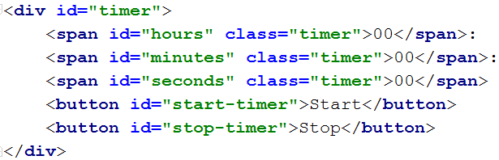
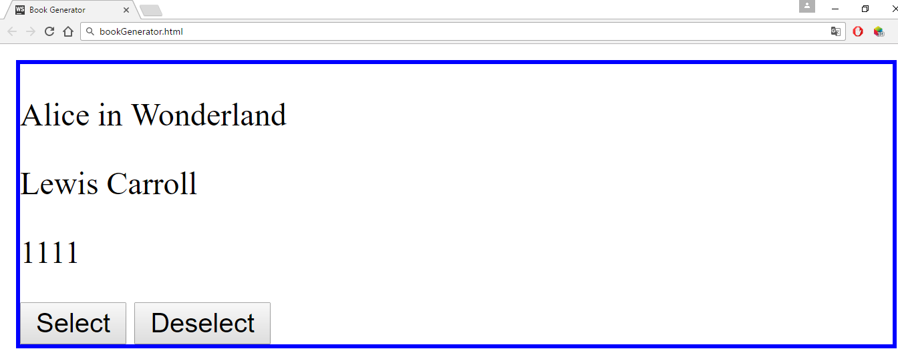
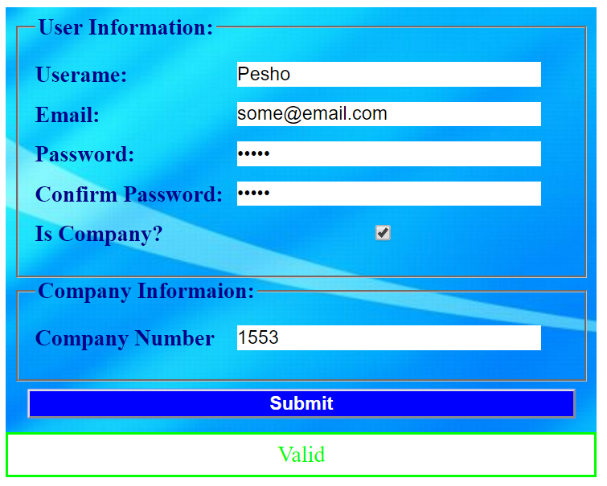

Exercises: jQuery, DOM and Events
=================================

Problems for exercises and homework for the [“JavaScript Advanced”
course @ SoftUni](https://softuni.bg/courses/javascript-advanced).
Submit your solutions in the SoftUni judge system at
<https://judge.softuni.bg/Contests/278/jQuery-and-DOM>.

Increment Counter
-----------------

You are tasked with creating a piece of **HTML** dynamically using
JavaScript and **appending** it to a given element using a passed in
**selector**.

### HTML and JavaScript Code

You are given the following **HTML** code:

| incrementCounter.html                                             |
|-------------------------------------------------------------------|
| &lt;!DOCTYPE **html**&gt;                                         
 &lt;**html lang="en"**&gt;                                         
 &lt;**head**&gt;                                                   
 &lt;**meta charset="UTF-8"**&gt;                                   
 &lt;**title**&gt;Increment Counter&lt;/**title**&gt;               
 &lt;**script src="https://code.jquery.com/jquery-3.1.0.min.js"     
 integrity="sha256-cCueBR6CsyA4/9szpPfrX3s49M9vUU5BgtiJj06wt/s="    
 crossorigin="anonymous"**&gt;&lt;/**script**&gt;                   
 &lt;/**head**&gt;                                                  
 &lt;**body**&gt;                                                   
 &lt;**div id="wrapper"**&gt;                                       
 &lt;/**div**&gt;                                                   
 &lt;**script src="incrementCounter.js"**&gt;&lt;/**script**&gt;    
 &lt;**script**&gt;                                                 
 **window**.onload = **function**(){                                
 *increment*(**"\#wrapper"**);                                      
 }                                                                  
 &lt;/**script**&gt;                                                
 &lt;/**body**&gt;                                                  
 &lt;/**html**&gt;                                                  |

It comes together with the following **JavaScript** code:

| incrementCounter.js            |
|--------------------------------|
| **function** *increment*() {   
 *// **TODO                      
 ***}                            |

Your function will receive a **string** value representing a
**selector** (for example "**\#wrapper**" or "**.root**"), all elements
created should be appended to the **selector**.

The HTML you create should contain 4 elements:

-   **&lt;textarea&gt;** with **class="counter"**, **value="0"** and the
    **disabled** attribute.

-   **&lt;button&gt;** with **class="btn"**, **id="incrementBtn"** and
    text "**Increment**".

-   **&lt;button&gt;** with **class="btn"**, **id="addBtn"** and text
    "**Add**".

-   Unordered list **&lt;ul&gt;** with **class="results"**.

When the **\[Increment\]** is clicked the value of the **textarea**
should go up by **one** (if it was 0 it should become 1 e.t.c.). When
the **\[Add\]** is clicked a new list item (**&lt;li&gt;**) with text
equal to the current value of the textarea should be added to the
unordered list.

Submit in the judge the JS code (implementation) of the above function.
It may hold other functions in its body.

### Screenshots

### Hints

We’ll start off by creating the needed elements and parsing the
**selector**, we can do it easily with **jQuery** like this:

Adding multiple elements to the DOM can be expensive, instead of
repeatedly adding to the DOM we can create a **DocumentFragment** and
**add** the elements to it instead. When we have built our hierarchy we
can **append the** **DocumentFragment** to the DOM, which will add all
of the fragment’s elements to the specified selector.  
  
The next step is to **add values**, and **attributes** to the
**elements** and **events** to the **buttons**:

The last step is to **add** our elements to the DOM:

Our code is now ready to be submitted to Judge.

Timer
-----

You will be given an **HTML** file, containing the markup of a **timer**
with spans for **seconds**, **minutes** and **hours** and buttons to
**\[Start\]** and **\[Pause\]** the timer. Your task is to create a
JavaScript application that **starts** the timer whenever the
**\[Start\]** button is pressed and **pauses** it when the **\[Pause\]**
button is pressed.

### HTML and JavaScript Code

You are given the following **HTML** code:

| timer.html                                                        |
|-------------------------------------------------------------------|
| &lt;!DOCTYPE **html**&gt;                                         
 &lt;**html lang="en"**&gt;                                         
 &lt;**head**&gt;                                                   
 &lt;**meta charset="UTF-8"**&gt;                                   
 &lt;**title**&gt;Timer&lt;/**title**&gt;                           
 &lt;**script src="https://code.jquery.com/jquery-3.1.0.min.js"     
 integrity="sha256-cCueBR6CsyA4/9szpPfrX3s49M9vUU5BgtiJj06wt/s="    
 crossorigin="anonymous"**&gt;&lt;/**script**&gt;                   
 &lt;**style**&gt;                                                  
 **\#timer** {                                                      
 **font-size**: 5**em**;                                            
 }                                                                  
 &lt;/**style**&gt;                                                 
 &lt;/**head**&gt;                                                  
 &lt;**body**&gt;                                                   
 &lt;**div id="timer"**&gt;                                         
 &lt;**span id="hours" class="timer"**&gt;00&lt;/**span**&gt;:      
 &lt;**span id="minutes" class="timer"**&gt;00&lt;/**span**&gt;:    
 &lt;**span id="seconds" class="timer"**&gt;00&lt;/**span**&gt;     
 &lt;**button id="start-timer"**&gt;Start&lt;/**button**&gt;        
 &lt;**button id="stop-timer"**&gt;Stop&lt;/**button**&gt;          
 &lt;/**div**&gt;                                                   
 &lt;**script src="timer.js"**&gt;&lt;/**script**&gt;               
 &lt;**script**&gt;                                                 
 **window**.onload=**function**(){                                  
 *timer*();                                                         
 }                                                                  
 &lt;/**script**&gt;                                                
 &lt;/**body**&gt;                                                  
 &lt;/**html**&gt;                                                  |

It comes together with the following **JavaScript** code:

| timer.js                   |
|----------------------------|
| **function** *timer*() {   
 *// **TODO                  
 ***}                        |

Submit in the judge the JS code (implementation) of the above function.
It may hold other functions in its body.

### Constraints

-   The initial value of the timer must always be **00:00:00**

### Hints

Note the spans have unique **id** values – we can use these to select
and modify the elements with **jQuery**.

JavaScript has a built-in function **setInterval()** for executing and
repeating an action after a set period of time. It returns an object
which can later be used to stop the execution with **clearInterval()**.

The **first argument** can be an inline declaration or a **named
function**. The **second argument** is the **time interval**, specified
in **milliseconds**. We can easily attach these two functions to the
click event of a button.

To get and set the text of a markup element you can either use its
**textContent** property, or jQuery’s **text()** function.

Keep in mind that that you should only have one **setInterval()**
function active when the the timer is working, multiple presses of the
**\[Start\]** button should not attach more **setInterval()** functions
as that would break the correct operation of the timer.

Book Generator
--------------

Create a function that accepts a **selector**, a **title**, an
**author** and an **ISBN** and **uses** them to **create** the **HTML
code** for a **book** and **inserts it** into the **selector**.

### HTML and JavaScript Code

You are given the following **HTML** code:

| book-generator.html                                                                    |
|----------------------------------------------------------------------------------------|
| &lt;!DOCTYPE **html**&gt;                                                              
 &lt;**html lang="en"**&gt;                                                              
 &lt;**head**&gt;                                                                        
 &lt;**meta charset="UTF-8"**&gt;                                                        
 &lt;**title**&gt;Book Generator&lt;/**title**&gt;                                       
 &lt;**script src="https://code.jquery.com/jquery-3.1.0.min.js"                          
 integrity="sha256-cCueBR6CsyA4/9szpPfrX3s49M9vUU5BgtiJj06wt/s="                         
 crossorigin="anonymous"**&gt;&lt;/**script**&gt;                                        
 &lt;/**head**&gt;                                                                       
 &lt;**body**&gt;                                                                        
 &lt;**div id="wrapper"**&gt;                                                            
                                                                                         
 &lt;/**div**&gt;                                                                        
 &lt;**script src="book-generator.js"**&gt;&lt;/**script**&gt;                           
 &lt;**script**&gt;                                                                      
 window.onload = **function** () {                                                       
 *createBook*(**"\#wrapper"**, **"Alice in Wonderland"**, **"Lewis Carroll"**, 1111);    
 }                                                                                       
 &lt;/**script**&gt;                                                                     
 &lt;/**body**&gt;                                                                       
 &lt;/**html**&gt;                                                                       |

It comes together with the following **JavaScript** code:

| book-generator.js               |
|---------------------------------|
| **function** *createBook*() {   
 *// **TODO                       
 ***}                             |

Your function will receive **4 parameters** - a **string value**
representing a **selector** (for example "**\#wrapper**" or
"**.root**"), a **string value** representing the **title** of the book,
a **string value** representing the **author** of the book and a
**number** representing the **ISBN** of the book. **After** the book is
**created** it should be **attached** to the passed in **selector**.

The **number** in the **Id** of the containing **div** should be
**incremented** by **one** **for each successive book created** (i.e.
first book should have **id = "book1"**, second **id = "book2"** and so
on…). The **title**, **author** and **ISBN** should be **paragraphs**
with a **class** equal to their **respective role** - **class="title"**
for the **title paragraph**, **class="author"** for the **author
paragraph** and **class="isbn"** for the **ISBN paragraph**. A book
should also contain **2 buttons** – **\[Select\]** and **\[Deselect\]**,
when the **\[Select\]** button is pressed the border of the **div**
element should be set to "**2px solid blue**". When the **\[Deselect\]**
button is pressed it should be set to "**none**".

### Screenshots

The HTML code for a book should have the following structure:

Selected book:

### Hints

You can use what is known as an **IIFE** (Immediately Invoked Function
Expression) to declare and instantly execute a function that will keep
the id variable in its scope. This way you will receive the inner
function and for it the variable **id** will be **shared between all
calls**, essentially becoming like a **static variable** for the
function:

An **element’s** **css properties** can easily be changed with
**jQuery** in the following way:

Form Validation
---------------

You are given the task to write **validation** for the fields of a
simple form.

### HTML and JavaScript Code

You are provided a **skeleton** containing the necessary files for your
program.

The validations should be as follows:

-   The **username** needs to be between **3** and **20** symbols
    **inclusively** and only **letters** and **numbers** are allowed.

-   The **password** and **confirm-password** must be between **5** and
    **15** **inclusively** symbols and only **word characters** are
    allowed (**letters**, **numbers** and **\_**).

-   The **inputs** of the **password** and **confirm-password** field
    **must match**.

-   The **email** field must contain the “**@**” symbol and **at least
    one** "**.**"(**dot**) after it.

> If the "**Is company?**" checkbox is **checked**, the **CompanyInfo**
> fieldset should become **visible** and the **Company Number** field
> must also be **validated**, if it isn’t checked the **Company**
> fieldset should have the style **"display: none;"** and the **value**
> of the **Company Number** field shouldn’t matter.

-   The **Company Number** field must be a number between **1000** and
    **9999**.

Every field with an **incorrect** value when the **\[Submit\]** button
is **pressed** should have the following style applied **border-color:
red;**, alternatively if it’s correct it should have style **border:
none;**. If there are **required fields** with an incorrect value when
the **\[Submit\]** button is pressed, the **div** with **id="valid"**
should become **hidden** (**"display: none;"**), **alternatively** if
all fields are correct the **div** should become **visible**.

### Constraints

-   **You are NOT allowed to change the HTML or CSS files provided.**

### Screenshots

### Hints

-   Use **addEventListener()** or jQuery’s **on()** function to
    **attach** an **event listener** for the "**change**" event to the
    **checkbox**.

-   All buttons within a **&lt;form&gt;** automatically work as
    **submit** buttons, unless their type is **manually** **assigned**
    to something else, in order to avoid **reloading** **the page** upon
    **clicking** the **\[Submit\]** button you can add the following
    code in the function that handles the on click event:

    

-   The validation for the separate fields can be done using **regex**.

DOM Search
----------

Write a JS function that **generates a form** for managing a list of
items and inserts it in an HTML document by given **selector** (e.g. by
**div id**).

### HTML and JavaScript Code

You are given the following **HTML** code:

| dom-search.html                                                   |
|-------------------------------------------------------------------|
| &lt;!DOCTYPE **html**&gt;                                         
 &lt;**html lang="en"**&gt;                                         
 &lt;**head**&gt;                                                   
 &lt;**meta charset="UTF-8"**&gt;                                   
 &lt;**title**&gt;DOM Search&lt;/**title**&gt;                      
 &lt;**script src="https://code.jquery.com/jquery-3.1.0.min.js"     
 integrity="sha256-cCueBR6CsyA4/9szpPfrX3s49M9vUU5BgtiJj06wt/s="    
 crossorigin="anonymous"**&gt;&lt;/**script**&gt;                   
 &lt;**style**&gt;                                                  
 .**add-controls**, .**search-controls** {                          
 **width**: 20**em**;                                               
 **height**: 2**em**;                                               
 }                                                                  
 **input** {                                                        
 **position**: **absolute**;                                        
 **left**:6**em**;                                                  
 }                                                                  
 .**button** {                                                      
 **background-color**: **darkgrey**;                                
 **color**: **white**;                                              
 **font-weight**: **bold**;                                         
 **position**: **absolute**;                                        
 **left**: 15**em**;                                                
 **border**: 1**px solid black**;                                   
 **padding**: 0 5**px** 0 5**px**;                                  
 }                                                                  
 .**result-controls** .**button** {                                 
 **position**: **relative**;                                        
 **left**: 0;                                                       
 **font-size**: 50%;                                                
 **margin-right**:1**em**;                                          
 **padding**: 0;                                                    
 **bottom**: 3**px**;                                               
 }                                                                  
 **li** {                                                           
 **list-style-type**: **none**;                                     
 }                                                                  
 &lt;/**style**&gt;                                                 
 &lt;/**head**&gt;                                                  
 &lt;**body**&gt;                                                   
 &lt;**div id="content"**&gt;&lt;/**div**&gt;                       
 &lt;**script src="dom-search.js"**&gt;&lt;/**script**&gt;          
 &lt;**script**&gt;                                                 
 *domSearch*(**"\#content"**,**false**);                            
 &lt;/**script**&gt;                                                
 &lt;/**body**&gt;                                                  
 &lt;/**html**&gt;                                                  |

It comes together with the following **JavaScript** code:

| dom-search.js                  |
|--------------------------------|
| **function** *domSearch*() {   
 *// **TODO                      
 ***}                            |

Your function will receive **two arguments** – the **first** is a
**selector** to an HTML element, the **second** is a **Boolean value**,
indicating whether the search function is **case-sensitive**. If set to
**true**, searches are case sensitive, if set to **false**, or not set,
searches ignore casing.

The user must be able to:

-   Add a new item with specified string content.

-   Delete an existing element.

-   Search for all elements containing a given string.

Each of the controls must be in a separate **div**. Place the add
controls inside a **div** with a class **add-controls**, and provide a
**label** with the text “**Enter text:**”, an **empty input field** and
an **anchor** with the class **button** applied to it. The **anchor**
acts as an **add button** and when the user presses it, a **new item
must be added to the list**, using the string in the **input field** as
its **name**.

Place the search controls inside a **div** with a class
**search-controls**, and provide a **label** with the text "**Search:**"
and an empty input field. When the user starts typing, the list of items
should display **only the items** that **contain** the given string. The
search **is case-sensitive only if specified with an argument**. When
nothing is entered, the list will contain all elements.

Place the result controls inside a **div** with a class
**result-controls** and in a list of class **items-list**. Each element
has the class **list-item**. When the list is filtered with a search,
all elements that need to be left out must be applied a style of
**display:none;**. Don’t forget to **remove the style** after the search
string is **removed**!

Every element is composed of an **anchor** with inner text "**X**"
functioning as a **delete button** and its name wrapped in a
**&lt;strong&gt;** tag. The anchor has the class **button**. When the
button is clicked, the element is **deleted** from the list.

### Screenshots  

### Hints

Take a look at the following screenshot – it contains the HTML hierarchy
for the form you see in the previous images. Note the last three
elements in the list are set to style **display:none;**, which will hide
them from view.

\*Calendar
----------

Write a program that **generates** a monthly calendar by given date. It
should be formatted as an **HTML table** with a **caption** for the
month and year and headings for each column for the days of the week.
The current date must be **highlighted** with a **different style** than
the rest of the table cells.

### Screenshots

### HTML and JavaScript Code

You are given the following **HTML** code:

| calendar.html                                                     |
|-------------------------------------------------------------------|
| &lt;!DOCTYPE **html**&gt;                                         
 &lt;**html lang="en"**&gt;                                         
 &lt;**head**&gt;                                                   
 &lt;**meta charset="UTF-8"**&gt;                                   
 &lt;**title**&gt;Calendar&lt;/**title**&gt;                        
 &lt;**script src="https://code.jquery.com/jquery-3.1.0.min.js"     
 integrity="sha256-cCueBR6CsyA4/9szpPfrX3s49M9vUU5BgtiJj06wt/s="    
 crossorigin="anonymous"**&gt;&lt;/**script**&gt;                   
 &lt;**style**&gt;                                                  
 **table**, **th**, **td** {                                        
 **border**: 1**px solid black**;                                   
 **padding**: 0.25**em**;                                           
 **margin**: 0;                                                     
 **border-collapse**: **collapse**;                                 
 **border-spacing**: 0;                                             
 }                                                                  
 **th**, **td** {                                                   
 **width**: 2.5**em**;                                              
 }                                                                  
 .**today** {                                                       
 **background-color**: **orange**;                                  
 **color**: **white**;                                              
 }                                                                  
 &lt;/**style**&gt;                                                 
 &lt;/**head**&gt;                                                  
 &lt;**body**&gt;                                                   
 &lt;**div id="content"**&gt;                                       
 &lt;/**div**&gt;                                                   
 &lt;**script src="calendar.js"**&gt;&lt;/**script**&gt;            
 &lt;**script**&gt;                                                 
 **window**.onload = **function**(){                                
 *calendar*(\[15,1,2017\]);                                         
 }                                                                  
 &lt;/**script**&gt;                                                
 &lt;/**body**&gt;                                                  
 &lt;/**html**&gt;                                                  |

It comes together with the following **JavaScript** code:

| calendar.js                   |
|-------------------------------|
| **function** *calendar*() {   
 *// **TODO                     
 ***}                           |

Your script needs to insert the generated calendar in the **\#content**
**div**. The resulting table should have the following format:

| HTML                                                                                        |
|---------------------------------------------------------------------------------------------|
| &lt;**table**&gt;                                                                           
 &lt;**caption**&gt;January 2017&lt;/**caption**&gt; *&lt;!-- Table caption --&gt;            
 *&lt;**tbody**&gt;                                                                           
 &lt;**tr**&gt;                                                                               
 &lt;**th**&gt;Mon&lt;/**th**&gt; *&lt;!-- Heading --&gt;                                     
 *…                                                                                           
 &lt;/**tr**&gt;                                                                              
 &lt;**tr**&gt;                                                                               
 &lt;**td**&gt;&lt;/**td**&gt; *&lt;!-- Empty element --&gt;                                  
 *…                                                                                           
 &lt;**td**&gt;1&lt;/**td**&gt;                                                               
 &lt;/**tr**&gt;                                                                              
 &lt;**tr**&gt;                                                                               
 …                                                                                            
 &lt;**td class="today"**&gt;15&lt;/**td**&gt; *&lt;!-- Current date is highlighted --&gt;    
 *&lt;/**tr**&gt;                                                                             
 …                                                                                            
 &lt;/**tbody**&gt;                                                                           
 &lt;/**table**&gt;                                                                           |

Your function will receive an array of three numbers representing a date
as follows: **\[day, month, year\]**

### Requirements

-   Current **month** and **year** are listed in a **&lt;caption&gt;**
    element with the month displayed as a **full capitalized name** and
    the **year** with **all digits**;

-   The **first row** contains **headings** for the **days** **of the
    week**, **shortened** to **3 letters**: **Mon**, **Tue**, **Wed**,
    etc.;

-   Each week is a complete row – **pad** the week with **empty cells**
    (empty string as cell content) if the month **doesn’t start on a
    Monday** or **end on a Sunday**;

-   The table should contain **only as many rows as needed** – some
    months may need 6 weeks, others just 5.

### Hints

-   JavaScript has a built-in **Date** object, which can be used to
    construct a date with arguments and then extract the current day of
    the week using the **getDay()** method. You can familiarize yourself
    with the object properties here:
    <http://www.w3schools.com/jsref/jsref_obj_date.asp>

-   Try setting the day of the **month** to **0** and see what the
    result will be.

-   Notice that the passed in arguments in the example **\[15, 1,
    2017\]** correspond to **15th January 2017**

\*\*Wiki Parser
---------------

You are tasked by Wikipedia to write a JS program that parses text
according to their internal markup in the browser. Your program will
receive a **selector** to a **paragraph** of text and has to scan it for
special symbol combinations that denote specific style for the text that
is enclosed in them. For instance, text surrounded by double single
quotes (''**text**'') must be displayed in italics. Look bellow for a
full list of features.

### Screenshots

### HTML and JavaScript Code

You are given the following **HTML** code:

| wiki-parser.html                                                  |
|-------------------------------------------------------------------|
| &lt;!DOCTYPE **html**&gt;                                         
 &lt;**html lang="en"**&gt;                                         
 &lt;**head**&gt;                                                   
 &lt;**meta charset="UTF-8"**&gt;                                   
 &lt;**title**&gt;Wiki Parser&lt;/**title**&gt;                     
 &lt;**script src="https://code.jquery.com/jquery-3.1.0.min.js"     
 integrity="sha256-cCueBR6CsyA4/9szpPfrX3s49M9vUU5BgtiJj06wt/s="    
 crossorigin="anonymous"**&gt;&lt;/**script**&gt;                   
 &lt;/**head**&gt;                                                  
 &lt;**body**&gt;                                                   
 &lt;**div**&gt;                                                    
 &lt;**p id="wiki"**&gt;                                            
 =Document title=                                                   
 ==First segment==                                                  
 '''bold 1''' word ''italics 1'' '''bold2'''                        
 \[\[hyper first\]\] '''Bold three''' ''italics2'''                 
 word \[\[hyper2\]\] \[\[hyperlink2|with Label\]\]                  
 ==Second segment==                                                 
 ===Third segment===                                                
 word '''word'''\[\[pipe|bomb\]\]                                   
 &lt;/**p**&gt;                                                     
 &lt;/**div**&gt;                                                   
 &lt;**script src="wiki-parser.js"**&gt;&lt;/**script**&gt;         
 &lt;**script**&gt;                                                 
 **window**.onload = **function**(){                                
 *wikiParser*(**'\#wiki'**);                                        
 }                                                                  
 &lt;/**script**&gt;                                                
 &lt;/**body**&gt;                                                  
 &lt;/**html**&gt;                                                  |

It comes together with the following **JavaScript** code:

| wiki-parser.js                  |
|---------------------------------|
| **function** *wikiParser*() {   
 *// **TODO                       
 ***}                             |

Your function will receive a selector to an HTML element.

### Markup

The following symbols must be recognized and parsed:

-   **''text''** becomes **&lt;i&gt;text&lt;/i&gt;** (two single quotes)

-   **'''text'''** becomes **&lt;b&gt;text&lt;/b&gt;** (three
    single quotes)

-   **=text=**, **==text==** and **===text===** become
    **&lt;h1&gt;text&lt;/h1&gt;**, **&lt;h2&gt;text&lt;/h2&gt;** and
    **&lt;h3&gt;text&lt;/h3&gt;**

-   **\[\[link\]\]** becomes an anchor to **/wiki/link** with the same
    text, **&lt;a href="/wiki/link"&gt;link&lt;/a&gt;**

-   **\[\[link|Text\]\]** becomes an anchor to **/wiki/link** with the
    argument after the pipe as text,
    **&lt;a href="/wiki/link"&gt;Text&lt;/a&gt;**

Note all resulting hyperlinks are relative to **/wiki**

### Constraints

-   There will be no overlapping markup, i.e. there won’t be bold text
    inside a heading or a link

-   All hyperlinks will only consist of valid characters

