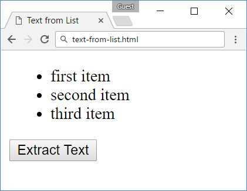
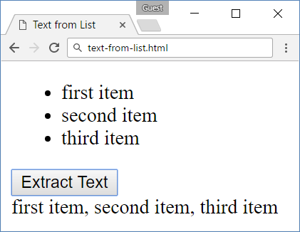
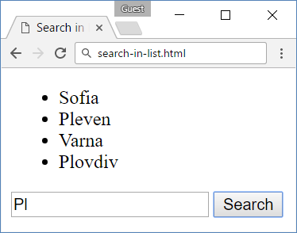
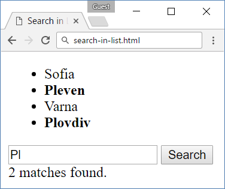
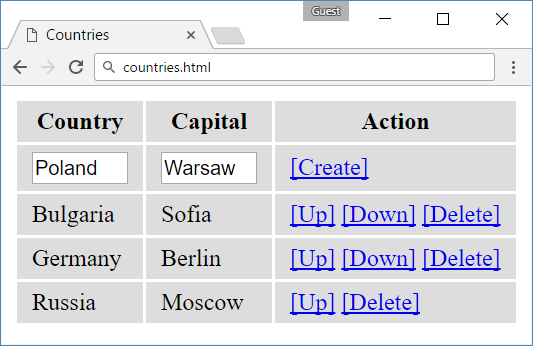
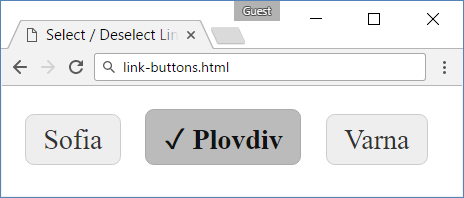
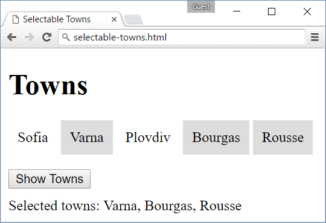

Lab: jQuery
===========

Problems for exercises and homework for the [“JavaScript Advanced”
course @ SoftUni](https://softuni.bg/courses/javascript-advanced).
Submit your solutions in the SoftUni judge system at
<https://judge.softuni.bg/Contests/329>.

Text from List
--------------

A HTML page holding a **list** of items and an **\[Extract Text\]**
button is given. Implement the **extractText** function which will be
called when the button's **onClick** event is fired.

### HTML and JavaScript Code

You are given the following **HTML** code:

| text.html                                                                                                                                                                         |
|-----------------------------------------------------------------------------------------------------------------------------------------------------------------------------------|
| &lt;!DOCTYPE **html**&gt;                                                                                                                                                         
 &lt;**html lang="en"**&gt;                                                                                                                                                         
 &lt;**head**&gt;                                                                                                                                                                   
 &lt;**meta charset="UTF-8"**&gt;                                                                                                                                                   
 &lt;**title**&gt;Text from List&lt;/**title**&gt;                                                                                                                                  
 &lt;**script src="https://code.jquery.com/jquery-3.1.1.min.js" integrity="sha256-hVVnYaiADRTO2PzUGmuLJr8BLUSjGIZsDYGmIJLv2b8=" crossorigin="anonymous"**&gt;&lt;/**script**&gt;    
 &lt;**script src="extractText.js"**&gt;&lt;/**script**&gt;                                                                                                                         
 &lt;/**head**&gt;                                                                                                                                                                  
 &lt;**body**&gt;                                                                                                                                                                   
 &lt;**ul id="items"**&gt;                                                                                                                                                          
 &lt;**li**&gt;first item&lt;/**li**&gt;                                                                                                                                            
 &lt;**li**&gt;second item&lt;/**li**&gt;                                                                                                                                           
 &lt;**li**&gt;third item&lt;/**li**&gt;                                                                                                                                            
 &lt;/**ul**&gt;                                                                                                                                                                    
 &lt;**button onclick="***extractText*()**"**&gt;                                                                                                                                   
 Extract Text&lt;/**button**&gt;                                                                                                                                                    
 &lt;**div id="result"**&gt;&lt;/**div**&gt;                                                                                                                                        
 &lt;/**body**&gt;                                                                                                                                                                  
 &lt;/**html**&gt;                                                                                                                                                                  |

It comes together with the following **JavaScript** code:

| extract-text.js                  |
|----------------------------------|
| **function** *extractText*() {   
 *// **TODO                        
 ***}                              |

### Screenshot

Search in List
--------------

An HTML page holds a **list** of towns, a **search** box and a
**\[Search\]** button. Implement the **search** function to **bold** the
items from the list which include the text from the **search** box. Also
print the amount of items the current search **matches** in the format
**"&lt;matches&gt; matches found."**

### HTML and JavaScript Code

You are given the following **HTML** code:

| list.html                                                                                                                                                                         |
|-----------------------------------------------------------------------------------------------------------------------------------------------------------------------------------|
| &lt;!DOCTYPE **html**&gt;                                                                                                                                                         
 &lt;**html lang="en"**&gt;                                                                                                                                                         
 &lt;**head**&gt;                                                                                                                                                                   
 &lt;**meta charset="UTF-8"**&gt;                                                                                                                                                   
 &lt;**title**&gt;Search in List&lt;/**title**&gt;                                                                                                                                  
 &lt;**script src="https://code.jquery.com/jquery-3.1.1.min.js" integrity="sha256-hVVnYaiADRTO2PzUGmuLJr8BLUSjGIZsDYGmIJLv2b8=" crossorigin="anonymous"**&gt;&lt;/**script**&gt;    
 &lt;**script src="search.js"**&gt;&lt;/**script**&gt;                                                                                                                              
 &lt;/**head**&gt;                                                                                                                                                                  
 &lt;**body**&gt;                                                                                                                                                                   
 &lt;**ul id="towns"**&gt;                                                                                                                                                          
 &lt;**li**&gt;Sofia&lt;/**li**&gt;                                                                                                                                                 
 &lt;**li**&gt;Pleven&lt;/**li**&gt;                                                                                                                                                
 &lt;**li**&gt;Varna&lt;/**li**&gt;                                                                                                                                                 
 &lt;**li**&gt;Plovdiv&lt;/**li**&gt;                                                                                                                                               
 &lt;/**ul**&gt;                                                                                                                                                                    
 &lt;**input type="text" id="searchText"** /&gt;                                                                                                                                    
 &lt;**button onclick="***search*()**"**&gt;Search&lt;/**button**&gt;                                                                                                               
 &lt;**div id="result"**&gt;&lt;/**div**&gt;                                                                                                                                        
 &lt;/**body**&gt;                                                                                                                                                                  
 &lt;/**html**&gt;                                                                                                                                                                  |

It comes together with the following **JavaScript** code:

| search.js                   |
|-----------------------------|
| **function** *search*() {   
 *// **TODO                   
 ***}                         |

### Screenshots

Countries Table
---------------

You are given and HTML table holding **countries** and their
**capitals**. You need to implement a **\[Create\]** link to create a
new country and for each existing country implement **\[Up\]**,
**\[Down\]** and **\[Delete\]** links to manipulate its position in the
table.

The table needs to have the following entries when it’s initialized
(**add them when your functions starts**):

Bulgaria, Sofia

Germany, Berlin

Russia, Moscow

### HTML and JavaScript Code

You are given the following **HTML** code:

| countries.html                                                                                                                                                                    |
|-----------------------------------------------------------------------------------------------------------------------------------------------------------------------------------|
| &lt;!DOCTYPE **html**&gt;                                                                                                                                                         
 &lt;**html lang="en"**&gt;                                                                                                                                                         
 &lt;**head**&gt;                                                                                                                                                                   
 &lt;**meta charset="UTF-8"**&gt;                                                                                                                                                   
 &lt;**title**&gt;Countries Table&lt;/**title**&gt;                                                                                                                                 
 &lt;**style**&gt;                                                                                                                                                                  
 **td**, **th** { **background**: **\#DDD**; **padding**: 5**px** 10**px** }                                                                                                        
 **input**\[**type**=**'text'**\] { **width**: 60**px** }                                                                                                                           
 &lt;/**style**&gt;                                                                                                                                                                 
 &lt;**script src="https://code.jquery.com/jquery-3.1.1.min.js" integrity="sha256-hVVnYaiADRTO2PzUGmuLJr8BLUSjGIZsDYGmIJLv2b8=" crossorigin="anonymous"**&gt;&lt;/**script**&gt;    
 &lt;**script src="initialize-table.js"**&gt;&lt;/**script**&gt;                                                                                                                    
 &lt;/**head**&gt;                                                                                                                                                                  
 &lt;**body**&gt;                                                                                                                                                                   
 &lt;**table id="countriesTable"**&gt;                                                                                                                                              
 &lt;**tr**&gt;                                                                                                                                                                     
 &lt;**th**&gt;Country&lt;/**th**&gt;                                                                                                                                               
 &lt;**th**&gt;Capital&lt;/**th**&gt;                                                                                                                                               
 &lt;**th**&gt;Action&lt;/**th**&gt;                                                                                                                                                
 &lt;/**tr**&gt;                                                                                                                                                                    
 &lt;**tr**&gt;                                                                                                                                                                     
 &lt;**td**&gt;&lt;**input type="text" id="newCountryText"** /&gt;&lt;/**td**&gt;                                                                                                   
 &lt;**td**&gt;&lt;**input type="text" id="newCapitalText"** /&gt;&lt;/**td**&gt;                                                                                                   
 &lt;**td**&gt;&lt;**a href="\#" id="createLink"**&gt;\[Create\]&lt;/**a**&gt;&lt;/**td**&gt;                                                                                       
 &lt;/**tr**&gt;                                                                                                                                                                    
 &lt;/**table**&gt;                                                                                                                                                                 
 &lt;**script**&gt;$(() =&gt; *initializeTable*())&lt;/**script**&gt;                                                                                                               
 &lt;/**body**&gt;                                                                                                                                                                  
 &lt;/**html**&gt;                                                                                                                                                                  |

It comes together with the following **JavaScript** code:

| initialize-table.js                  |
|--------------------------------------|
| **function** *initializeTable*() {   
 *// **TODO                            
 ***}                                  |

### Screenshots

Link Buttons
------------

You are given HTML holding some buttons. Implement the **attachEvents**
function which should attach **click** events on the buttons. When a
button is **clicked** it should **remove** the **class="selected"**
attribute from the button that currently holds it and **add it to its
own attributes**.

### HTML, CSS and JavaScript Code

You are given the following **HTML** code:

| buttons.html                                                                              |
|-------------------------------------------------------------------------------------------|
| &lt;!DOCTYPE **html**&gt;                                                                 
 &lt;**html lang="en"**&gt;                                                                 
 &lt;**head**&gt;                                                                           
 &lt;**meta charset="UTF-8"**&gt;                                                           
 &lt;**title**&gt;Title&lt;/**title**&gt;                                                   
 &lt;**link rel="stylesheet" href="link-buttons.css"** /&gt;                                
 &lt;**script src="https://code.jquery.com/jquery-3.1.1.min.js"**&gt;&lt;/**script**&gt;    
 &lt;**script src="link-buttons.js"**&gt;&lt;/**script**&gt;                                
 &lt;/**head**&gt;                                                                          
 &lt;**body onload="**attachEvents()**"**&gt;                                               
 &lt;**a class="button"**&gt;Sofia&lt;/**a**&gt;                                            
 &lt;**a class="button"**&gt;Plovdiv&lt;/**a**&gt;                                          
 &lt;**a class="button"**&gt;Varna&lt;/**a**&gt;                                            
 &lt;/**body**&gt;                                                                          
 &lt;/**html**&gt;                                                                          |

It comes with this **CSS**:

| link-buttons.css                              |
|-----------------------------------------------|
| **a**.**button** {                            
 **border**: 1**px solid \#CCC**;               
 **background**: **\#EEE**;                     
 **padding**: 5**px** 10**px**;                 
 **border-radius**: 5**px**;                    
 **color**: **\#333**;                          
 **text-decoration**: **none**;                 
 **display**: **inline-block**;                 
 **margin**: 5**px**;                           
 }                                              
                                                
 **a**.**button**.**selected** {                
 **color**: **\#111**;                          
 **font-weight**: **bold**;                     
 **border**: 1**px solid \#AAA**;               
 **background**: **\#BBB**;                     
 }                                              
                                                
 **a**.**button**.**selected**::**before** {    
 **content**: **"\\2713\\20\\20"**;             
 }                                              
                                                
 **a**:**hover** {                              
 **cursor**: **pointer**;                       
 }                                              |

and the following **JavaScript** code:

| link-buttons.js                   |
|-----------------------------------|
| **function** *attachEvents*() {   
 *// **TODO                         
 ***}                               |

### Screenshots

### Hints

-   Use the **attachEventListener** function.

Selectable Towns
----------------

Create an HTML page listing **towns**, a town should be selectable.
Clicking on a town should **select/deselect** it, a selected town should
have the **data-selected** attribute added to it and its background
color should be changed to **\#DDD**. Also create a button **\[Show
Towns\]** that prints the text **"Selected towns: "** followed by all
selected towns joined with a **", "**.

### HTML and JavaScript Code

You are given the following **HTML** code:

| towns.html                                                                                |
|-------------------------------------------------------------------------------------------|
| &lt;!DOCTYPE **html**&gt;                                                                 
 &lt;**html lang="en"**&gt;                                                                 
 &lt;**head**&gt;                                                                           
 &lt;**meta charset="UTF-8"**&gt;                                                           
 &lt;**title**&gt;Selectable Towns&lt;/**title**&gt;                                        
 &lt;**style**&gt;                                                                          
 **li** {                                                                                   
 **display**: **inline-block**;                                                             
 **cursor**: **pointer**;                                                                   
 **padding**: 10**px**;                                                                     
 }                                                                                          
 **ul** { **padding**:0; }                                                                  
 &lt;/**style**&gt;                                                                         
 &lt;**script src="https://code.jquery.com/jquery-3.1.1.min.js"**&gt;&lt;/**script**&gt;    
 &lt;**script src="select-towns.js"**&gt;&lt;/**script**&gt;                                
 &lt;/**head**&gt;                                                                          
 &lt;**body**&gt;                                                                           
 &lt;**h2**&gt;Towns&lt;/**h2**&gt;                                                         
 &lt;**ul id="items"**&gt;                                                                  
 &lt;**li**&gt;Sofia&lt;/**li**&gt;                                                         
 &lt;**li**&gt;Varna&lt;/**li**&gt;                                                         
 &lt;**li**&gt;Plovdiv&lt;/**li**&gt;                                                       
 &lt;**li**&gt;Bourgas&lt;/**li**&gt;                                                       
 &lt;**li**&gt;Rousse&lt;/**li**&gt;                                                        
 &lt;/**ul**&gt;                                                                            
 &lt;**button id="showTownsButton"**&gt;Show Towns&lt;/**button**&gt;                       
                                                                                            
 &lt;**div** **id="selectedTowns"**&gt;&lt;/**div**&gt;                                     
 &lt;**script**&gt;$(*attachEvents*())&lt;/**script**&gt;                                   
 &lt;/**body**&gt;                                                                          
 &lt;/**html**&gt;                                                                          |

It comes together with the following **JavaScript** code:

| select-towns.js                   |
|-----------------------------------|
| **function** *attachEvents*() {   
 *// **TODO                         
 ***}                               |

### Screenshots

### 
