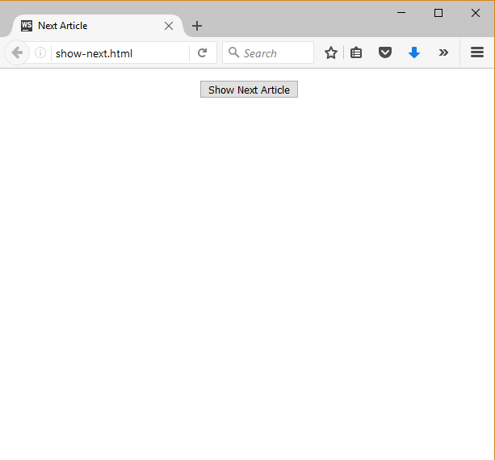

Lab: Advanced Functions
=======================

Problems for in-class lab for the [“JavaScript Advanced” course @
SoftUni](https://softuni.bg/courses/javascript-advanced). Submit your
solutions in the SoftUni judge system at
<https://judge.softuni.bg/Contests/330/>.

Aggregates
----------

Write a JS program that uses a **reducer** function to **display**
information about an **input array**.

### Input

You will receive an **array** of **numeric** values.

### Output

The output should be the **printed** on the console. Display the **sum**
of all elements in the array, the value of the **smallest**, the value
of the **biggest**, the **product** of all elements and a string of all
elements **joined** together.

### Examples

| Sample Input          | Output           |
|-----------------------|------------------|
| \[2,3,10,5\]          | Sum = 20         
                                           
                         Min = 2           
                                           
                         Max = 10          
                                           
                         Product = 300     
                                           
                         Join = 23105      |
| \[5, -3, 20, 7, 0.5\] | Sum = 29.5       
                                           
                         Min = -3          
                                           
                         Max = 20          
                                           
                         Sum = -1050       
                                           
                         Join = 5-32070.5  |

Currency Format
---------------

Write a higher-order JS function that fixes some of the parameters of
another function. Your program will receive a function that takes 4
parameters and returns a formatted string (a monetary value with
currency symbol). Your task is to return another function that only
takes one parameter and returns the same formatted string.

This is the function you will receive:

| currencyFormatter                                                   |
|---------------------------------------------------------------------|
| function currencyFormatter(separator, symbol, symbolFirst, value) { 
                                                                      
 let result = Math.trunc(value) + separator;                          
                                                                      
 result += value.toFixed(2).substr(-2,2);                             
                                                                      
 if (symbolFirst) return symbol + ' ' + result;                       
                                                                      
 else return result + ' ' + symbol;                                   
                                                                      
 }                                                                    |

Set the following parameters to fixed values:

separator: ","

symbol: "$"

symbolFirst: true

The final parameter **value** is the one that the returned function will
receive.

### Input

You will receive a **function** parameter.

### Output

You need to **return a function** that takes one parameter – **value**.

### Examples

| Sample Input                                       |
|----------------------------------------------------|
| let dollarFormatter = result(currencyFormatter);   
                                                     
 console.log(dollarFormatter(5345)); *// $ 5345,00*  
                                                     
 console.log(dollarFormatter(3.1429)); *// $ 3,14*   
                                                     
 console.log(dollarFormatter(2.709)); *// $ 2,71*    |

Command Processor
-----------------

Write a JS program that keeps a string **inside it’s context** and can
execute different **commands** that modify or output the string on the
console.

**append(str)** – add **str** to the end of the internal string

**removeStart(n)** – **remove** the **first** **n** characters from the
string, **n** is an integer

**removeEnd(n)** – **remove** the **last n** characters from the string,
**n** is an integer

**print** – **output** the stored string to the **console**

### Input

You will receive an **array** of **strings**. Each element is a command
that may be a single word or contain an argument, separated by space.

### Output

Whenever you receive the command **print**, output should be the
**printed** on the console. Any other operations are carried onto the
**internal** storage of the function.

### Examples

| Sample Input      | Output |
|-------------------|--------|
| \['append hello', 
                    
 'append again',    
                    
 'removeStart 3',   
                    
 'removeEnd 4',     
                    
 'print'\]          | loa    |
| \['append 123',   
                    
 'append 45',       
                    
 'removeStart 2',   
                    
 'removeEnd 1',     
                    
 'print'\]          | 34     |

Max Element
-----------

Write a JS program that takes an **array** of **numeric elements** as
input and **returns** the **largest** element of the array.

### Input

You will receive an **array** of **numbers**.

### Output

The **output** should be the **return** value of your function. It
represents the **largest element** of the array.

### Examples

| Sample Input       | Output |
|--------------------|--------|
| \[10, 20, 5\]      | 20     |
| \[1, 44, 123, 33\] | 123    |

Next Article
------------

Write a JS program that sequentially **displays articles** on a web page
when the user **clicks** a button. You will receive an **array of
strings** that will initialize the program. You need to return a
function that keeps the initial array in its closure and every time it’s
called, it takes the first element from the array and displays it on the
web page, inside a div with ID "**content**". If there are no more
elements left, your function should do nothing.

### HTML and JavaScript Code

You are given the following **HTML** code:

| article.html                                                                                                                                                                                                   |
|----------------------------------------------------------------------------------------------------------------------------------------------------------------------------------------------------------------|
| &lt;!DOCTYPE **html**&gt;                                                                                                                                                                                      
 &lt;**html lang="en"**&gt;                                                                                                                                                                                      
 &lt;**head**&gt;                                                                                                                                                                                                
 &lt;**meta charset="UTF-8"**&gt;                                                                                                                                                                                
 &lt;**title**&gt;Next Article&lt;/**title**&gt;                                                                                                                                                                 
 &lt;**style**&gt;**div**{**width**:600**px**; **text-align**: **center**; **font-size**: 1.5**em**} **article**{**border**: 2**px solid blue**; **padding**: 2**em**; **margin**: 1**em**}&lt;/**style**&gt;    
 &lt;**script src="https://code.jquery.com/jquery-3.1.1.min.js" integrity="sha256-hVVnYaiADRTO2PzUGmuLJr8BLUSjGIZsDYGmIJLv2b8=" crossorigin="anonymous"**&gt;&lt;/**script**&gt;                                 
 &lt;**script src="next-article.js"**&gt;&lt;/**script**&gt;                                                                                                                                                     
 &lt;/**head**&gt;                                                                                                                                                                                               
 &lt;**body**&gt;                                                                                                                                                                                                
 &lt;**div id="content"**&gt;&lt;/**div**&gt;                                                                                                                                                                    
 &lt;**div**&gt;&lt;**button onclick="*showNext***()**"**&gt;Show Next Article&lt;/**button**&gt;&lt;/**div**&gt;                                                                                                
 &lt;**script**&gt;                                                                                                                                                                                              
 let ***articles*** =\[                                                                                                                                                                                          
 **"Cats are the most popular pet in the United States: There are 88 million pet cats and 74 million dogs."**,                                                                                                   
 **"A group of cats is called a clowder."**,                                                                                                                                                                     
 **"Cats have over 20 muscles that control their ears."**,                                                                                                                                                       
 **"A cat has been mayor of Talkeetna, Alaska, for 15 years. His name is Stubbs."**,                                                                                                                             
 **"The world's largest cat measured 48.5 inches long."                                                                                                                                                          
 **\];                                                                                                                                                                                                           
 let ***showNext*** = *getArticleGenerator*(***articles***);                                                                                                                                                     
 &lt;/**script**&gt;                                                                                                                                                                                             
 &lt;/**body**&gt;                                                                                                                                                                                               
 &lt;/**html**&gt;                                                                                                                                                                                               |

It comes together with the following **JavaScript** code:

| next-article.js                                  |
|--------------------------------------------------|
| **function** *getArticleGenerator*(articles) {   
 *// **TODO***                                     
 }                                                 |

Your function will be called automatically, there is **no need** to
attach any event listeners.

### Input

You will receive and **array** of strings.

### Output

Return a **function** that displays the array elements on the web page.

### Examples

