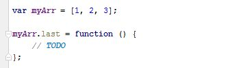
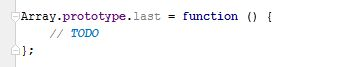
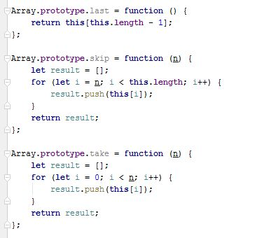
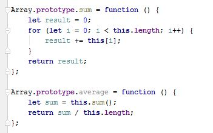
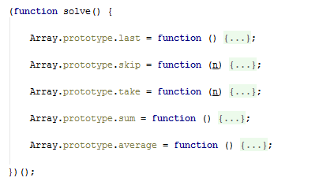
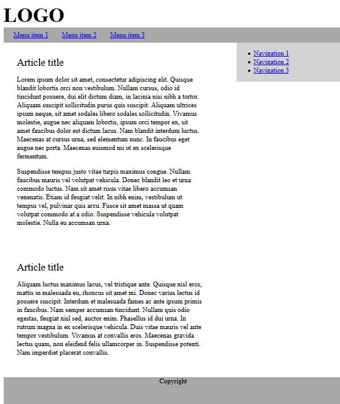
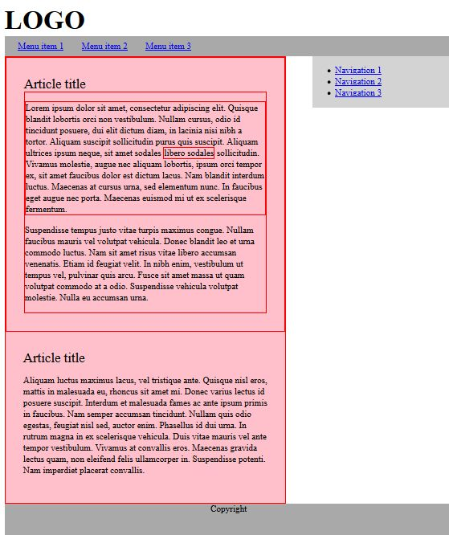

Exercises: Objects, Inheritance and Prototypes
==============================================

Problems for exercises and homework for the [“JavaScript Advanced”
course @ SoftUni](https://softuni.bg/courses/javascript-advanced).
Submit your solutions in the SoftUni judge system at
<https://judge.softuni.bg/Contests/301/>.

Array extension
---------------

**Extend** the build-in **Array** object with additional functionality.
Implement the following functionality:

-   **last()** – returns the last element of the array

-   **skip(n)** – returns a new array which includes all original
    elements, except the first **n** elements; **n** is a **Number**
    parameter

-   **take(n)** – returns a new array containing the first **n**
    elements from the original array; **n** is a **Number** parameter

-   **sum()** – returns a sum of all array elements

-   **average()** – returns the average of all array elements

### Input / Output

**Input** for functions that expect it will be passed as valid
**parameters**. **Output** from functions should be their **return**
value.

Structure your code as an **IIFE**.

### Hints

If we have an **instance** of and array, since we know it’s an object,
adding new properties to it is pretty straightforward:

This however, only adds our new function to this instance. To add all
functions just one time and have them work on **all arrays** is not much
more complicated, we just have to attach them to Array’s **prototype**
instead:

With such a declaration, we gain access to the context of the calling
instance via **this**. We can then easily access indexes and other
existing properties. Don’t forget we don’t want to modify the exiting
array, but to create a new one:

Note these functions do not have any error checking – if **n** is
negative or outside the bounds of the array, and exception will be
thrown, so take care when using them, or add your own validation. The
last two functions require a little bit of arithmetic to be performed:

To test our
program in the Judge, we need to wrap it in an IIFE, like it’s shown on
the right. There is no return value, since the code execution results in
functionality being added to and existing object, so they take effect
instantly. We are ready to submit our solution.

Construction Crew
-----------------

Write a JS program that **receives** a worker **object** as a
**parameter** and modifies its properties. Workers have the following
structure:

{ weight: Number,

experience: Number,

bloodAlcoholLevel: Number,

handsShaking: Boolean }

**Weight** is expressed in **kilograms**, **experience** in **years**
and **bloodAlcoholLevel** is in **milliliters**. If you receive a worker
who’s **handsShaking** property is set to **true** it means he needs to
intake some alcohol in order to be able to work correctly. The required
amount is 0.1ml per **kilogram** per year of **experience**. The
required amount must be **added** to the **existing amount**. Once the
alcohol is administered, change the **handsShaking** property to
**false**.

Workers whose hands aren’t shaking should **not** be modified in any
way. Return them as they were.

### Input

Your function will receive a valid **object** as **parameter**.

### Output

Return the **same object** that was passed in, **modified** as
necessary.

### Examples

| Input                   | Output                  |
|-------------------------|-------------------------|
| { weight: 80,           
                          
 experience: 1,           
                          
 bloodAlcoholLevel: 0,    
                          
 handsShaking: true }     | { weight: 80,           
                                                    
                           experience: 1,           
                                                    
                           bloodAlcoholLevel: 8,    
                                                    
                           handsShaking: false }    |
| { weight: 120,          
                          
 experience: 20,          
                          
 bloodAlcoholLevel: 200,  
                          
 handsShaking: true }     | { weight: 120,          
                                                    
                           experience: 20,          
                                                    
                           bloodAlcoholLevel: 440,  
                                                    
                           handsShaking: false }    |
| { weight: 95,           
                          
 experience: 3,           
                          
 bloodAlcoholLevel: 0,    
                          
 handsShaking: false }    | { weight: 95,           
                                                    
                           experience: 3,           
                                                    
                           bloodAlcoholLevel: 0,    
                                                    
                           handsShaking: false }    |

Car Factory
-----------

Write a JS program that assembles a car by **given requirements** out of
**existing** **components**. The client will place an order in the form
of an **object describing** the car. You need to **determine** which
parts to use to fulfil the client’s order. You have the following parts
in storage:

An **engine** has **power** (given in horsepower) and **volume** (given
in cubic centimeters). Both of these values are **numbers**. When
selecting an engine, pick the **smallest possible** that still meets the
requirements.

Small engine: { power: 90, volume: 1800 }

Normal engine: { power: 120, volume: 2400 }

Monster engine: { power: 200, volume: 3500 }

A **carriage** has a **type** and **color**. Both of these values are
**strings**. You have two types of carriages in storage and can paint it
**any color**.

Hatchback: { type: 'hatchback', color: &lt;as required&gt; }

Coupe: { type: 'coupe', color: &lt;as required&gt; }

The **wheels** will be represented by an **array** of 4 **numbers**,
each number represents the **diameter** of the wheel in inches. The size
can only be an **odd number**. Round **down** any requirements you
receive to the nearest odd number.

### Input

You will receive an **object** as an **argument** to your function. The
format will be as follows:

{ model: &lt;model name&gt;,

power: &lt;minimum power&gt;,

color: &lt;color&gt;,

carriage: &lt;carriage type&gt;,

wheelsize: &lt;size&gt; }

### Output

**Return** the resulting car **object** as a result of your function.
See the examples for details.

### Examples

| Sample input            | Output                         |
|-------------------------|--------------------------------|
| { model: 'VW Golf II',  
                          
 power: 90,               
                          
 color: 'blue',           
                          
 carriage: 'hatchback',   
                          
 wheelsize: 14 }          | { model: 'VW Golf II',         
                                                           
                           engine: { power: 90,            
                                                           
                           volume: 1800 },                 
                                                           
                           carriage: { type: 'hatchback',  
                                                           
                           color: 'blue' },                
                                                           
                           wheels: \[13, 13, 13, 13\] }    |
| { model: 'Opel Vectra', 
                          
 power: 110,              
                          
 color: 'grey',           
                          
 carriage: 'coupe',       
                          
 wheelsize: 17 }          | { model: 'Opel Vectra',        
                                                           
                           engine: { power: 120,           
                                                           
                           volume: 2400 },                 
                                                           
                           carriage: { type: 'coupe',      
                                                           
                           color: 'grey' },                
                                                           
                           wheels: \[17, 17, 17, 17\] }    |

Extensible object
-----------------

Create an object that can **clone** the **functionality** of another
object into itself. Implement an **extend(template)** function that
would copy all of the properties of **template** to the parent object
and if the property is a function, add it to the object’s **prototype**
instead.

### Input / Output

Your code should **return** the extensible **object instance**. The
**extend()** function of your object will receive a valid object as
**input parameter**, and has **no** output.

### Examples

| Extensible object                 | Resulting object                 |
|-----------------------------------|----------------------------------|
| myObj: {                          
                                    
 \_\_proto\_\_: {}                  
                                    
 extend: function () {…}            
                                    
 }                                  | myObj: {                         
                                                                       
                                     \_\_proto\_\_: {                  
                                                                       
                                     extensionMethod: function () {…}  
                                                                       
                                     },                                
                                                                       
                                     extend: function () {…},          
                                                                       
                                     extensionProperty: 'someString'   
                                                                       
                                     }                                 |
| Template object                   |                                  |
| template: {                       
                                    
 extensionMethod: function () {…},  
                                    
 extensionProperty: 'someString'    
                                    
 }                                  |                                  |

Note that **\_\_proto\_\_** is a hidden property, representing the
object’s **prototype** – depending on your test environment, you may not
have access to it directly, but you can use other functions to do that.

### Hints

To gain access to the prototype of an instance, use the
**Object.getPrototypeOf()** function. To make a function shared between
all instances, it’ll have to be attached to the prototype instead of the
instance.

String extension
----------------

**Extend** the build-in String object with additional functionality.
Implement the following functions:

-   **ensureStart(str)** – append **str** to the beginning of a string,
    **only** if it’s **not** already present

-   **ensureEnd(str)** – append **str** to the end of a string, **only**
    if it’s **not** already present

-   **isEmpty()** – return **true** if the string is **empty**,
    **false** otherwise

-   **truncate(n)** – truncates the string to **n** characters by
    **removing words** and appends an ellipsis (three periods) to
    the end. If a string is less than **n** characters long, return the
    **same string**. If it is longer, split the string where a **space**
    occurs and append an ellipsis to it so that the **total length** is
    less than or equal to **n**. If **no space** occurs anywhere in the
    string, return **n – 3** characters and an ellipsis. If **n** is
    less than 4, return **n** amount of periods.

-   **format(string, …params)** – static method to replace placeholders
    with parameters. A placeholder is a number surrounded by
    curly braces. If parameter index cannot be found for a certain
    placeholder, do not modify it. Note static methods are attached to
    the **String object** instead of it’s prototype. See the examples
    for more info.

Note strings are **immutable**, so your functions will return new
strings as a result.

### Input / Output

Your **main code** should be structured as an **IIFE** **without**
**input or output** – it should **modify** the existing **String**
**prototype** instead.

Input and output of the **extension functions** should be as described
above.

### Examples

| Sample input                           | Value of *str*                       |
|----------------------------------------|--------------------------------------|
| let str = 'my string'                  
                                         
 str = str.ensureStart('my')             
                                         
 str = str.ensureStart('hello ')         
                                         
 str = str.truncate(16)                  
                                         
 str = str.truncate(14)                  
                                         
 str = str.truncate(8)                   
                                         
 str = str.truncate(4)                   
                                         
 str = str.truncate(2)                   
                                         
 str = String.format('The {0} {1} fox',  
                                         
 'quick', 'brown');                      
                                         
 str = String.format('jumps {0} {1}',    
                                         
 'dog');                                 | 'my string' // 'my' already present  
                                                                                
                                          'hello my string'                     
                                                                                
                                          'hello my string' // length is 15     
                                                                                
                                          'hello my...' // length is 11         
                                                                                
                                          'hello...'                            
                                                                                
                                          'h...'                                
                                                                                
                                          '..'                                  
                                                                                
                                          'The quick brown fox'                 
                                                                                
                                          'jumps dog {1}' // no parameter at 1  |

\*Sorted List
-------------

Implement a **collection**, which keeps a list of numbers, sorted in
**ascending order**. It must support the following functionality:

-   **add(elemenent)** – adds a new element to the collection

-   **remove(index)** – removes the element at position **index**

-   **get(index)** – returns the value of the element at position
    **index**

-   **size** – number of elements stored in the collection

The **correct order** of the element must be kept **at all times**,
regardless of which operation is called. **Removing** and **retrieving**
elements **shouldn’t** work if the provided index points **outside the
length** of the collection (either throw an error or do nothing). Note
the **size** of the collection is **not** a function. Write your code
such that the first function in your solution **returns an instance** of
your Sorted List.

### Input / Output

All function that expect **input** as **parameters** will receive valid
data. Any result expected from a function should be **returned** as it’s
result. Your **main function** should **return** an **object**
**instance** with the required functionality as it’s result.

DOM Traversal
-------------

Write a program that recursively **traverses** all child nodes of an
HTML element and **highlights** a path to the **deepest node**. Your
script will be placed inside an HTML page and a **selector** will be
passed to it. Starting from a given node and searching downwards, once
the node with the deepest nesting is found, add the class **highlight**
to it to change its appearance. Add the same class to **all parent
nodes** all the way to the **selector**. If two elements have the same
depth, highlight the **first encountered**.

### Input

Your function will be placed inside an HTML document and a **selector**
to an HTML element will be passed to it.

### Output

There is no output, your program should **modify** the HTML instead.

### Example

Use the provided [HTML
skeleton](https://judge.softuni.bg/Contests/Practice/DownloadResource/1671)
to test your code. Note you will need to download and include jQuery
manually, if you want to use it in your local tests. You may find it
here: <http://jquery.com/download/>

\* Bug Tracker
--------------

Create a JS program for managing bug reports. It must perform as a
self-contained module with exposed functionality. Whenever a new element
is added, deleted or changed with a command, the HTML should be updated
automatically. A bug report has the following structure:

{ ID: Number,

author: String,

description: String,

reproducible: Boolean,

severity: Number,

status: String }

The **ID** of each report has to be a **unique** number, starting from
**zero** and increasing **sequentially**. The module needs to implement
the following **functions**:

**report(author, description, reproducible, severity)** – **create** a
new bug report and store it. The **ID** is assigned automatically to the
next available number and the **status** defaults to **'Open'**

**setStatus(id, newStatus)** – change the status of a bug registered in
the system to **newStatus** by given **ID**

**remove(id)** – delete a bug report by given **ID**

**sort(method)** – change the order in which bug reports are displayed
on the webpage. The **method** argument is a string and can be either
**'author'**, **'severity'** or **'ID'**. Always sort in ascending order
(default behavior for alphabetical sort). The default sorting method is
by **'ID'**.

**output(selector)** – set the HTML element inside which the result is
to be displayed to **selector**

Use the following structure for each HTML report:

| HTML                                                            |
|-----------------------------------------------------------------|
| &lt;div id="report\_${ID}" class="report"&gt;                   
                                                                  
 &lt;div class="body"&gt;                                         
                                                                  
 &lt;p&gt;${description}&lt;/p&gt;                                
                                                                  
 &lt;/div&gt;                                                     
                                                                  
 &lt;div class="title"&gt;                                        
                                                                  
 &lt;span class="author"&gt;Submitted by: ${author}&lt;/span&gt;  
                                                                  
 &lt;span class="status"&gt;${status} | ${severity}&lt;/span&gt;  
                                                                  
 &lt;/div&gt;                                                     
                                                                  
 &lt;/div&gt;                                                     |

Use the provided [HTML
skeleton](https://judge.softuni.bg/Contests/Practice/DownloadResource/1681)
to test your solution locally. Note that you will have to manually add
any scripts you wish to use for testing, including jQuery.

### Input

Input will be passed to each applicable function as **parameters** in
the correct format.

### Output

Your solution must **expose a module** with all required functions
bundled in it (**return** it as a result of your main function). The
**HTML** should be **modified** as specified.
